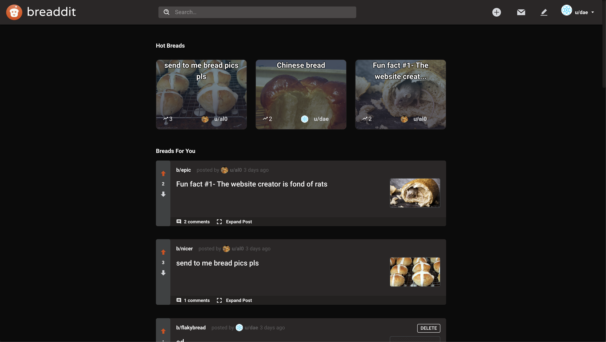

# Breaddit

- A reddit clone to talk about breads.
- Sign up/Log in and join this community of bakers and bread lovers in a reddit like platform,
  to share your thoughts on your favorite kinds of breads in subreaddits of your choice,
  and interact with them, through your votes and comments.
- Installable as a PWA!
- [Visit site](https://breadddit.web.app/) to see it in action.

## Screenshots

---

## Built using

- React
- Redux / Redux-saga
- Typescript
- Go
- Gin-gonic
- Material UI
- Gitlab CI
- Docker
- AWS S3 / ECS / ECR
- GCloud & Firebase

## Steps to run locally

- Clone the repo and install dependencies with `npm install` (or) `yarn` in `client`, and `go mod vendor` in `server`.
- Create a `.env` in src directory of `client` with a variable named `REACT_APP_X_API_KEY` containing your x-api-key, which must be added to `server` too.
- In root directory run `cd client && yarn start` and `cd server && go run main.go`.
- go to `localhost:8080`

## License

[MIT](LICENSE) © [Pradeep-selva](https://github.com/Pradeep-selva)
